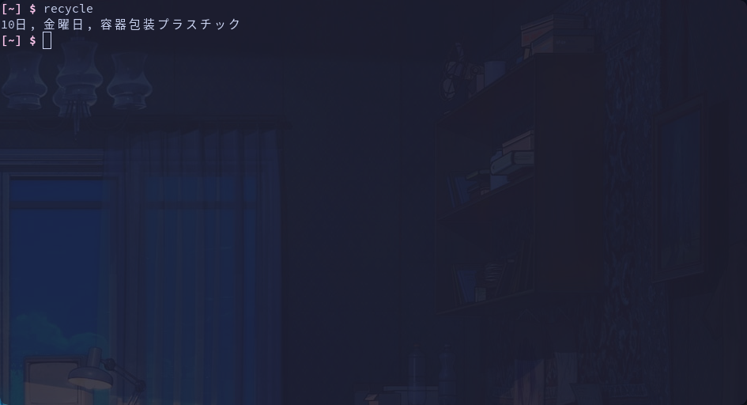

# recycle

Chofu(調布市) has its own recycle rules.
One should put out the trash according to the rules.

The script checks [the rules](https://www.city.chofu.tokyo.jp/www/contents/1646875289947/index.html) in [this page](https://www.city.chofu.tokyo.jp/www/contents/1646875289947/simple/text20222.txt), and outputs the item which is going to be collected. It outputs today's item if the current time is AM. Otherwise, it outputs tomorrow's one.

