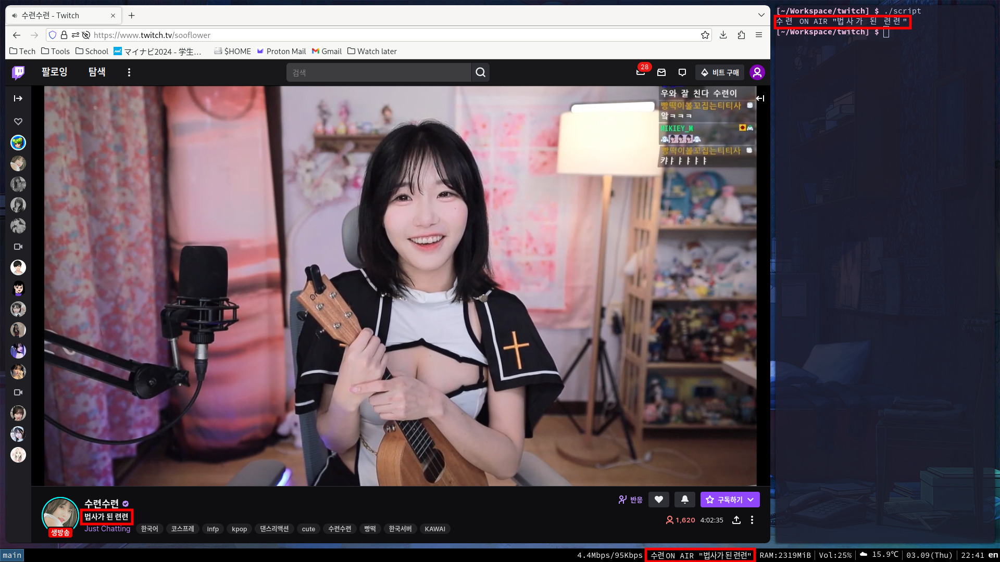

# twitch

[수련수련](https://www.twitch.tv/sooflower)(sooflower) is my favorite twitch-streamer.
She is so adorable, dances well. She usually starts her stream around 7 pm.
I can't wait watching her.

The script outputs the title of her stream if she is on the air.
I implemeted it with [Twitch CLI](https://github.com/twitchdev/twitch-cli) and [Twitch API](https://dev.twitch.tv/docs/api/reference/).

As a matter of fact, the script itself is not that useful.
Again, I embed it on my status bar, and updates it every 5 seconds so that I can notice the stream immediately.

Am I weird?
