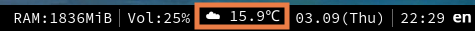

# weather

Have you heard of [wttr.in](https://github.com/chubin/wttr.in)?
It is a weather forecast service for CLI environment.
However, the location of forecast is very limited, and it doesn't support accurate time.

The script queries [this site](https://weathernews.jp/onebox/tenki/tokyo/13208/), and shows current temperature of Chofu(調布) with a cute emoji.
I use it embedding on my status bar, updating every 10 minutes. 
